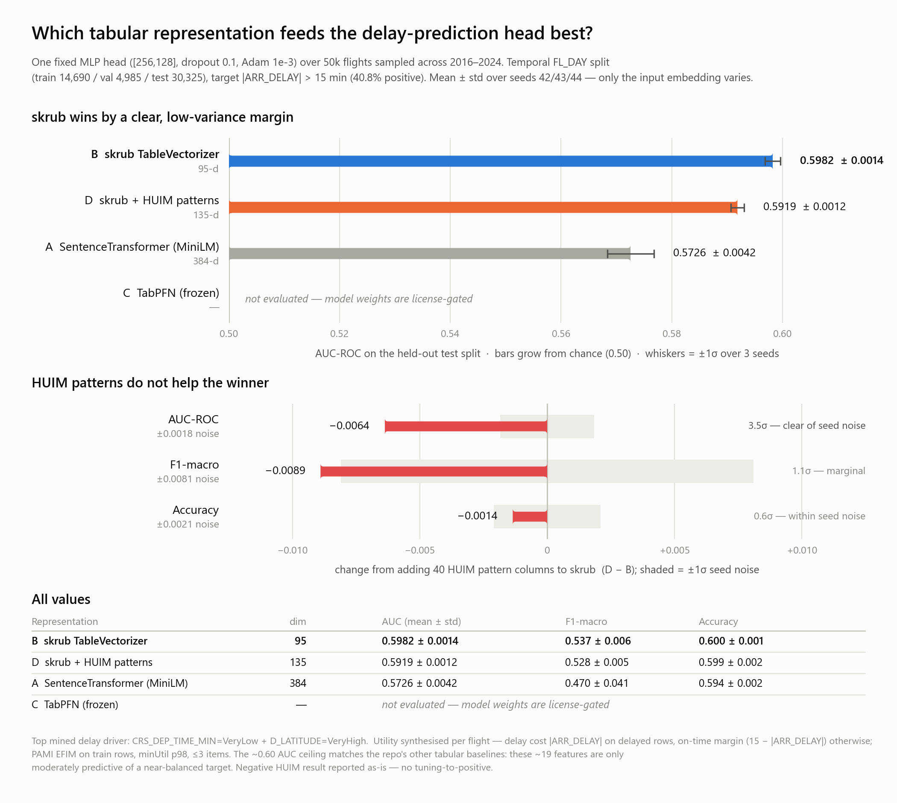

# Representation Bake-off — Results

**Question:** Which tabular representation best feeds one fixed MLP head for flight-delay
prediction, and does adding HUIM delay-cost patterns to the winner help?

**Setup (identical across every row):** 50k rows stratified over all years 2016–2024;
temporal `FL_DAY` split (train 14,690 / val 4,985 / test 30,325); target `|ARR_DELAY|>15`
(40.8% positive); one plain-torch MLP head (`[256,128]`, dropout 0.1, Adam 1e-3);
AUC primary + F1-macro + accuracy, mean ± std over seeds `[42,43,44]`.

Regenerate the figure (light + dark PNGs into `figures/`) after any re-run:
`uv run python exp/Tab_exp/representation_bakeoff/make_figures.py`

## Table

| # | Representation | dim | AUC (mean ± std) | F1-macro | Accuracy |
|---|---|---|---|---|---|
| **B** | **skrub TableVectorizer** | 95 | **0.5982 ± 0.0014** | 0.537 | 0.600 |
| A | SentenceTransformer (MiniLM) | 384 | 0.5726 ± 0.0042 | 0.470 | 0.594 |
| D | skrub + HUIM (winner + patterns) | 135 | 0.5919 ± 0.0012 | 0.528 | 0.599 |
| C | TabPFN (frozen embedder) | — | not evaluated — license-gated¹ |

## Findings

1. **skrub (B) is the best representation** by a clear, low-variance margin (+2.6% AUC
   over SentenceTransformer). It also produces the most compact, interpretable matrix (95-d).
2. **SentenceTransformer (A) is the weakest**, as expected: serialising rows to text lets
   the tokenizer mangle the numeric features.
3. **HUIM does not help here.** Concatenating 40 delay-cost pattern columns onto skrub
   *lowered* AUC by 0.6% (D 0.5919 vs B 0.5982) — a real negative outside the seed-noise
   band, not a wash (3.5σ of the seed-to-seed difference; F1-macro is down a marginal 1.1σ,
   accuracy is within noise). On this data the mined patterns add nothing over what skrub already
   encodes. Reported as-is (no tuning-to-positive). Top mined delay driver:
   `CRS_DEP_TIME_MIN=VeryLow + D_LATITUDE=VeryHigh`.
4. Overall ceiling is modest (~0.60 AUC) — consistent with the repo's other tabular
   baselines; these ~19 features are only moderately predictive of a near-balanced target.

¹ **TabPFN** (`tabpfn 8.x`, Prior Labs) gates model weights behind a one-time license/token.
To evaluate C later: create a free account, accept the license, then
`export TABPFN_TOKEN=<key>` and run `run_bakeoff.py --only tabpfn` followed by
`run_hybrid.py --winner <best>`. The embedder code (`embeddings/embed_tabpfn.py`) is ready.

## HUIM design note
No natural utility column exists in flight data, so utility was synthesised: each item in a
**delayed** flight carries the flight's `|ARR_DELAY|` (delay cost); in an **on-time** flight,
its on-time margin `(15 − |ARR_DELAY|)`. Mined per class with PAMI EFIM on train rows only
(minUtil p98, patterns ≤3 items, top-200 kept). Flight number was excluded as an item
(thousands of singletons → combinatorial blow-up).
