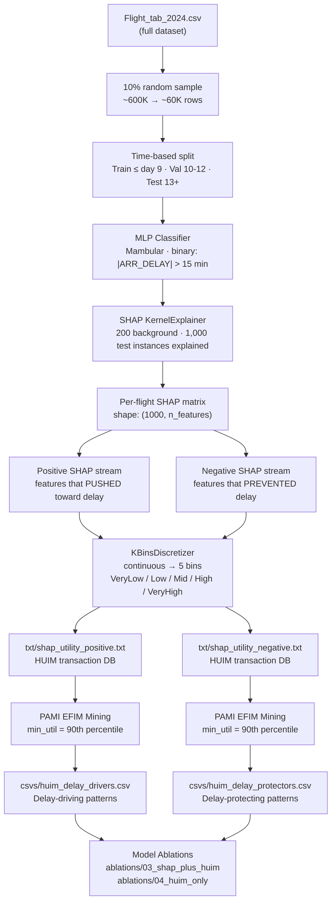

# SHAP × HUIM Experiment: Flight Delay Pattern Discovery
## Experiment: `01_2024_baseline`

> **Dataset:** `Flight_tab_2024.csv` · **Sample:** 10% · **Run:** `python run.py`

---

## Pipeline



---

## How Utility is Calculated

HUIM requires **positive integer utilities**. SHAP values are real-valued and can be positive or negative, so:

1. The SHAP matrix is **split into two streams** — positive SHAP (delay push) and negative SHAP (delay protection).
2. Each feature-value pair becomes a **HUIM item**. Its local utility for a flight is:

$$U(\text{item}_j, \text{flight}_i) = \text{int}(|\text{SHAP}_{i,j}| \times 10{,}000)$$

3. The **pattern utility** aggregates item utilities across all flights where the pattern co-occurs:

$$U(\text{Pattern}) = \sum_{\text{flight} \in \text{flights containing Pattern}} \sum_{\text{item} \in \text{Pattern}} U(\text{item, flight})$$

**Example:** `Origin=JFK + O_Longitude=VeryHigh` with utility **98K** means those two features, when appearing together, collectively pushed the model's output by an equivalent of **9.8 SHAP units** across the 1,000 explained flights.

---

## Results Summary

| Metric | Value |
|--------|-------|
| MLP AUC | ~0.55 |
| MLP Accuracy | ~0.59 |
| SHAP instances explained | 1,000 |
| Delay driver patterns | 9,566 |
| Delay protector patterns | 69,062 |

### SHAP Global Feature Importance

| Rank | Feature | Mean \|SHAP\| |
|------|---------|--------------|
| 1 | O_LONGITUDE | 0.110 |
| 2 | OP_CARRIER | 0.065 |
| 3 | CRS_ELAPSED_TIME | 0.063 |
| 4 | O_TEMP | 0.050 |
| 5 | OP_CARRIER_FL_NUM | 0.047 |
| 6 | CRS_DEP_TIME_MIN | 0.044 |

### Key Delay Driver Patterns

| Pattern | Utility | Interpretation |
|---------|---------|----------------|
| O_LONGITUDE=VeryHigh | 540K | Northeast US origins dominate delays |
| O_LATITUDE=High + O_LONGITUDE=VeryHigh | 463K | NYC-area airports |
| ORIGIN_INDEX=JFK + O_LONGITUDE=VeryHigh | 98K | JFK-specific delay pattern |
| OP_CARRIER=DL + O_LONGITUDE=VeryHigh | 98K | Delta at Northeast airports |
| CRS_ELAPSED_TIME=VeryHigh + O_WSPD=VeryHigh + O_LONGITUDE=VeryHigh | 96K | Long-haul + high wind from NE |

### Key Delay Protector Patterns

| Pattern | Utility | Interpretation |
|---------|---------|----------------|
| O_TEMP=Mid | 96K | Moderate origin temperature |
| O_LONGITUDE=High | 98K | Non-extreme longitude (Midwest) |
| OP_CARRIER=WN + CRS_ELAPSED_TIME=VeryLow + O_PRCP=VeryLow | ~10K | Short SW route, clear weather |
| CRS_ARR_TIME_MIN=VeryLow + O_PRCP=VeryLow + D_PRCP=VeryLow | ~10K | Early arrival, dry conditions |

---

## Key Findings

1. **Geography is the strongest signal**: `O_LONGITUDE=VeryHigh` (Northeast US) appears in nearly every top delay-driver pattern.
2. **Weather amplifies in combination**: Wind and temperature alone have moderate impact; combined with geography and scheduling they sharply increase delay risk.
3. **Carrier-specific patterns**: Delta (DL) / American (AA) at NE airports = delay drivers; Southwest (WN) / SkyWest (OO) on short regional routes = protectors.
4. **Actionable pattern size**: Top patterns contain 2–4 features — specific enough to act on, general enough to cover many flights.
5. **Asymmetry**: ~7× more protector patterns (69K) than driver patterns (9.5K) — on-time performance has diffuse causes; delays are driven by fewer concentrated factors.

---

## Folder Structure

```
01_2024_baseline/
├── config.yaml          ← experiment settings (data, SHAP, HUIM parameters)
├── run.py               ← full extraction pipeline (config-driven)
├── visualize.py         ← generates all figures from mined patterns
├── README.md            ← this file
├── csvs/
│   ├── huim_delay_drivers.csv       ← mined delay-driving patterns
│   ├── huim_delay_protectors.csv    ← mined delay-protecting patterns
│   ├── shap_feature_importance.csv  ← global SHAP feature ranking
│   └── huim_item_labels.csv         ← item ID → human-readable label
├── txt/
│   ├── shap_utility_positive.txt    ← HUIM transaction DB (delay drivers)
│   └── shap_utility_negative.txt    ← HUIM transaction DB (delay protectors)
└── figures/
    ├── 01_shap_feature_importance.png
    ├── 02_top15_delay_drivers.png
    ├── 03_top15_delay_protectors.png
    ├── 04_pattern_size_distribution.png
    └── 05_drivers_vs_protectors.png
```

---

## Downstream Usage

The mined CSVs are consumed by the model ablation experiments:

| Ablation | Uses |
|----------|------|
| `ablations/03_shap_plus_huim/` | `csvs/huim_delay_drivers.csv` + `csvs/huim_delay_protectors.csv` |
| `ablations/04_huim_only/` | same CSVs, as the **only** features |
